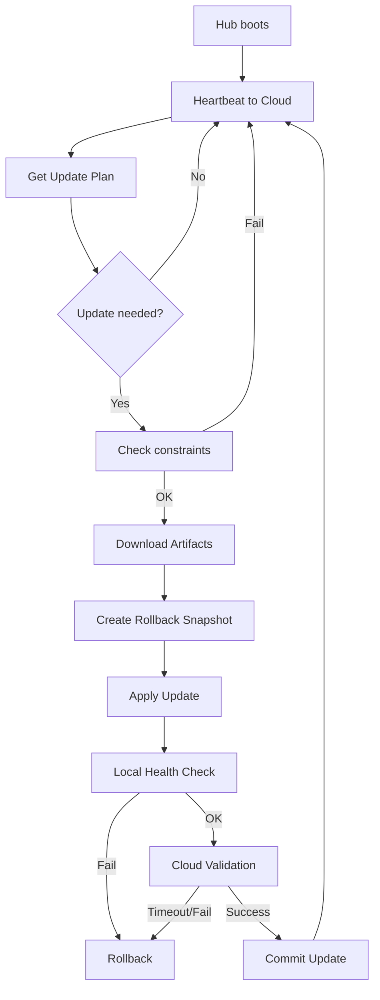

# VanCore Update System v1
_Comprehensive Architecture & Technical Specification_  
_Last updated: 2025‑11‑18_

---

# 1. Overview

This document defines the architecture, components, safety guarantees, and update workflow for the **VanCore Update System**.  
It describes how software on each VanCore Hub (VP2430) is updated **securely**, **reliably**, and with **near-zero risk** of losing remote control.

### Core design goals
- Updates must be **safe**, **rollback-capable**, and **recoverable**.
- The update mechanism must be **independent of the VPN system** (Tailscale / Headscale).
- All updates must flow through **outbound HTTPS only** — no inbound ports.
- Updates should occur only when the van is:
  - **Stationary**
  - **Has adequate signal**
  - Optionally: **sufficient battery / shore power**
- Cloud should always know:
  - Current version of each van
  - Update status
  - Health reports
- System must support seamless migration from:
  - MVP (Tailscale SaaS)
  - → to self‑hosted Headscale (via safe OTA)

---

# 2. System Architecture

The update architecture is built around **three components**:

1. **On‑Hub Update Agent** (runs on VP2430)
2. **Cloud Update Service / API**
3. **Artifact Storage** (S3‑style HTTPS hosting)

---

# 3. On‑Hub Update Agent

A lightweight daemon (Python/Go) running on the VP2430.

### Responsibilities
- Identify the device (van_id, versions, hardware).
- Periodically POST health + version to cloud.
- Fetch **update plans** via HTTPS.
- Enforce update constraints:
  - Stationary (via IMU)
  - Adequate signal (LTE/Wi‑Fi metrics)
  - Optional: battery thresholds
- Download artifacts with verification.
- Apply updates safely.
- Perform automatic rollback if validation fails.
- Report results to cloud.

### What the Update Agent can update
- VanCore platform stack (docker compose bundle)
- VanCore UI/frontend
- Home Assistant add‑ons
- Local services (e.g., cloud tunnel service)
- VPN configs (Tailscale → Headscale)
- Internal configuration files

---

# 4. Cloud Update Service

A backend service that defines the **desired state** of every van and returns detailed **update plans**.

### Key endpoints (conceptual)
```
POST /hub/register
POST /hub/heartbeat
GET  /update-plan?van_id=...
POST /update-result
```

### Responsibilities
- Store current + target versions for each van.
- Define rollout stages:
  - dev → pilot → fleet
- Generate update plans containing:
  - target versions
  - artifact URLs
  - checksums
  - step-by-step instructions
  - constraints (stationary, signal, battery)
- Monitor update reports + failures.
- Provide internal dashboard for support team.

---

# 5. Artifact Storage

Artifacts must be served via **HTTPS** from a reliable object store.

Stores:
- Docker images (via registry)
- tar/zip bundles
- config files
- firmware modules (rare)

Update Service only returns URLs + checksums;  
the **agent downloads artifacts directly** from the store.

---

# 6. Update Workflow (Hub Perspective)

## 6.1 Heartbeat & Version Reporting

Every X minutes, the agent sends:

```json
{
  "van_id": "VC-UK-00381",
  "current": {
    "platform": "0.9.1",
    "app": "0.9.3",
    "ha_addons": "0.4.0"
  },
  "health": {
    "disk_ok": true,
    "temp_ok": true,
    "last_update_status": "ok",
    "signal_quality": 0.78
  }
}
```

## 6.2 Request Update Plan

```
GET /update-plan?van_id=VC-UK-00381&platform=0.9.1&app=0.9.3
```

Cloud returns either:
- “Up to date”
- or detailed plan:

```json
{
  "update_required": true,
  "target": { "platform": "0.9.2" },
  "artifacts": [
    {
      "name": "vancore-platform-0.9.2",
      "type": "docker-bundle",
      "url": "https://artifacts.vancore.io/platform-0.9.2.tgz",
      "sha256": "abc123..."
    }
  ],
  "constraints": {
      "must_be_stationary": true,
      "min_signal_quality": 0.6,
      "min_battery_soc": 30
  }
}
```

---

# 7. Conditions for Safe Updating

Before any update:

### 1. Stationary check  
Use IMU to detect **low movement for 2–5 min**.

### 2. Signal quality check  
Evaluate:
- LTE RSRP / RSRQ  
- Wi‑Fi RSSI  
- Ping stability to cloud

### 3. Power check (optional)
Require battery SOC above threshold or shore power connected.

Only when all checks pass → agent proceeds.

---

# 8. Safe Apply & Rollback

## 8.1 Update Sequence

1. **Download artifacts**
   - Resume support
   - SHA‑256 verification

2. **Create rollback snapshot**
   - Previous versions
   - Current configs
   - Previous docker compose bundle

3. **Stop non‑critical services**
   - Show “Updating…” locally

4. **Apply update**
   - Replace docker compose bundle
   - Restart services
   - Apply migrations

5. **Local health check**
   - Containers running
   - Local `/health` endpoint OK

6. **Remote (cloud) validation**
   - Agent reports update status

7. **Validation timer (5–10 minutes)**
   - If agent maintains cloud connectivity + health → **commit**
   - If not → **automatic rollback**

## 8.2 Rollback Guarantee

Rollback triggers if:
- Cloud cannot be reached
- Local health check fails
- Critical container does not start
- Validation timer expires

Rollback restores:
- Last working versions
- Previous configs
- Previous docker bundle

---

# 9. Interaction with VPN (Tailscale / Headscale)

The update system **does not depend** on VPN.

VPN is **secondary** and optional for support engineers.

### VPN migration strategy (safe)
1. Add Headscale config (keep Tailscale SaaS running)
2. Confirm Headscale connectivity via HTTPS
3. Only then retire Tailscale SaaS
4. If Headscale misbehaves → rollback via HTTPS

At all times:
- Local access works (van Wi‑Fi)
- Cloud control works (HTTPS)

---

# 10. Rollout Strategy (Risk Management)

## Stages
1. **Internal (lab devices)**
2. **Pilot vans**
3. **Fleet rollout** (gradual, e.g. 5–10% per day)

## Monitoring
Dashboard tracks:
- Version per van
- Last update timestamp
- Update outcome
- Units needing intervention

---

## 10.5 Using Mender.io as an OTA Update Framework (Optional Implementation Path)

While the VanCore Update System is designed to be fully customisable and independent of any third-party OTA mechanisms, it is worth noting that **Mender.io** provides a mature, open-source OTA update framework that can accelerate early development.

Mender consists of two major components:

1. **Mender Client (runs on the Hub)**  
   - A Linux service installed on each VP2430.  
   - Handles:
     - Downloading update artifacts  
     - Applying updates  
     - Automatic rollback if new software fails to boot  
     - Secure communication with the Mender server  
   - Well-proven in embedded and IoT environments.

2. **Mender Server (self-hosted or SaaS)**  
   - Provides a web UI to:
     - View registered devices (each van)  
     - Define and upload update artifacts  
     - Create phased deployments to device groups  
     - Track update progress/failures  
   - Supports multiple deployment patterns including:
     - Application-level updates  
     - Container updates  
     - Full system image updates  

### Why Mender is useful for VanCore

Mender offers several features that map closely to the VanCore update requirements:

- **➡️ Easy deployment workflow**  
  Upload an artifact → choose a group → click “Deploy”.

- **➡️ Built-in automatic rollback**  
  If the update breaks services or fails to start correctly, Mender automatically restores the previous working version.

- **➡️ Fleet management out of the box**  
  Group vans into:
  - *internal devices*
  - *pilot customers*
  - *general fleet*  
  And deploy releases progressively.

- **➡️ Self-hosted option**  
  Fully aligns with VanCore’s requirement to avoid permanent SaaS dependencies or user data leakage.

- **➡️ Integrates cleanly with Docker-based systems**  
  Container updates can be packaged as Mender “application” artifacts.

### Caveats and limitations

- Mender does **not** know about VanCore-specific constraints such as:
  - “only update when stationary”
  - “only update with adequate signal”
  - “only update above minimum battery”
  
  These must be implemented using **client-side scripts** or **Mender state scripts**.

- Mender’s full-image rollback model may be overkill for the VP2430 where **Docker-level updates** are sufficient.

- You still need some glue code to integrate:
  - VanCore’s versioning logic  
  - VanCore’s local health checks  
  - Any VPN migration logic (Tailscale → Headscale)  

### When to consider Mender

- **Phase 1–2 (0 → ~20 vans)**  
  It can dramatically accelerate the initial OTA capability without building a backend from scratch.

- **Long-term**  
  You may keep Mender as the underlying OTA layer  
  **or**  
  Replace it with a fully custom VanCore OTA service once the product stabilises.

In summary, Mender.io provides a solid “drop-in” OTA engine that can reduce early complexity while still allowing VanCore to evolve toward a custom, domain-specific update system.

---

# 11. Full Flow Diagram



---

# 12. Summary

The VanCore Update System:

- Uses **HTTPS control plane** as the reliable backbone.
- Keeps VPN optional, not critical.
- Ensures safety with:
  - Stationary + signal constraints
  - Rollback snapshots
  - Validation windows
  - Multi-stage rollout
- Can safely migrate network subsystems (e.g., Tailscale → Headscale).
- Is **appliance-grade**, scalable, and extremely resilient.

