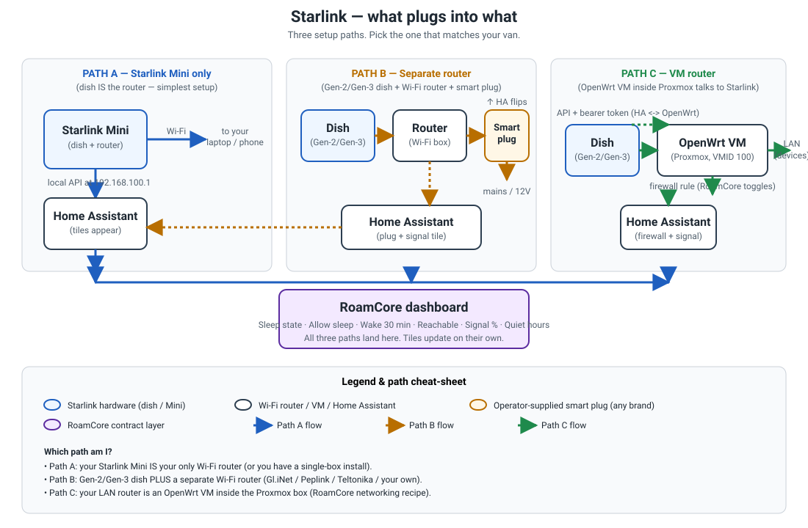

# Starlink

Starlink is SpaceX's satellite internet for vans — fast, mobile, but it
eats battery when left on all night. RoamCore gives you a sleep timer
(dish powers down during quiet hours), a one-tap **wake for 30
minutes** button when you need it back, and a signal tile so you
always know how good the link is.

**Tier:** B (recipe — you bring the dish + smart plug, we wire the rest)
**Install:** ~25 min, then it's automatic.

## What plugs into what



A clearer text version of the same diagram:

```
                         YOUR VAN
   ┌──────────────────────────────────────────────────────────────────┐
   │                                                                  │
   │   ┌──────────┐      ┌──────────────┐     ┌────────────┐         │
   │   │  Dish    │─────▶│  Router      │────▶│  Smart     │         │
   │   │ (in sky) │      │  (Wi-Fi box) │     │  plug      │         │
   │   └──────────┘      └──────────────┘     └─────┬──────┘         │
   │         │                                       │                │
   │         │ Path A: dish IS the router            │                │
   │         │ (Starlink Mini)                       │                │
   │                                               mains/12V          │
   │                                                  │                │
   │                                            ┌─────▼──────┐         │
   │                                            │ Home       │         │
   │                                            │ Assistant  │         │
   │                                            └─────┬──────┘         │
   │                                                  │                │
   │                                                  ▼                │
   │                                            ┌────────────┐         │
   │                                            │ RoamCore   │         │
   │                                            │ dashboard  │         │
   │                                            └────────────┘         │
   │                                                                  │
   │  Path B: separate router — smart plug lives behind the          │
   │          router OR the PSU (two ways to cut power)               │
   │                                                                  │
   │  Path C: VM router — OpenWrt VM in the Proxmox box talks to     │
   │          Starlink over the local API; RoamCore talks to OpenWrt  │
   └──────────────────────────────────────────────────────────────────┘
```

The 5 steps after this diagram walk you through wiring, choosing, and
verifying.

---

## Step 1 — What you need

- **A Starlink dish.** Gen-2, Gen-3, or **Starlink Mini** (the small
  flat one). Gen-1 (the round "dishy") still works but its signal tile
  is grayed out (no local API on Gen-1).
- **A controllable smart plug / relay** that Home Assistant can switch.
  Pick one:
  - **TP-Link Kasa** plug (Wi-Fi, easiest).
  - **Shelly Plug-S** (Wi-Fi, local API).
  - **Sonoff S31** (Wi-Fi, flashed with ESPHome).
  - **Zigbee smart plug** (Aqara / IKEA / Nous).
  - **Modbus DC switch** (for 12 V direct-from-battery installs).
- **For Path C only:** a router VM inside your Proxmox box (OpenWrt is
  already set up by RoamCore's networking recipe) with its API URL +
  bearer token.
- **A spare mains or 12 V outlet** near the Starlink PSU — the smart
  plug has to physically sit between the PSU and its power source.

That's it. No subscription changes, no Starlink account needed
(RoamCore talks to the dish on your local network, never to Starlink's
cloud).

---

## Step 2 — Plug it in

1. **Unplug the Starlink PSU** from the wall (or 12 V source).
2. **Plug the smart plug into the wall.** The smart plug's LED should
   come on.
3. **Plug the Starlink PSU into the smart plug's outlet.** (If you
   chose Path B's "router-only" variant — see Step 3 — plug only the
   router into the smart plug and leave the PSU wired straight to
   mains.)
4. **Wait 30 seconds.** The smart plug settles.
5. **Pair the smart plug with Home Assistant.** HA → **Settings →
   Devices & Services → Add Integration**, pick the plug's integration
   (TP-Link / Shelly / Sonoff / Zigbee), follow the prompts. Note the
   entity_id it gives you (e.g. `switch.starlink_plug`).
6. **Plug the Starlink PSU back in** via the smart plug. The dish
   powers up, acquires satellites in 30–90 seconds, and your normal
   Wi-Fi is back.

If you have a Starlink Mini (no separate router, the dish IS the Wi-Fi
box), skip the router split and put the smart plug right behind the
Mini's PSU.

---

## Step 3 — Pick your setup

Open the RoamCore wizard and it will ask you which way your van is
wired. Pick the path that matches your hardware:

| Path | When to pick it | What RoamCore wires up |
|---|---|---|
| **A — Starlink Mini only** | The dish IS your Wi-Fi router (Starlink Mini, or a single-box install). | Sleep timer + signal tile only. No plug needed for the simplest case, but you still pair one if you want full shutdown. |
| **B — Separate router** | You have a Starlink Gen-2/Gen-3 dish PLUS a separate Wi-Fi router (Gl.iNet / Peplink / Teltonika / your own). | Smart plug behind the router (or the PSU); RoamCore flips the plug for sleep + wake, and pulls signal stats from Starlink's local API. |
| **C — VM router** | Your "router" is an OpenWrt VM inside the Proxmox box (RoamCore's networking recipe). | RoamCore talks to OpenWrt's API for control, and to Starlink's local API for signal. No smart plug needed (the VM stays up; OpenWrt's firewall cuts Starlink). |

Most vans are Path **B**. If you have a Starlink Mini, you're on Path
**A**. If you run OpenWrt-in-Proxmox, you're on Path **C**.

### The 3 paths, drawn out

```
  PATH A: Starlink Mini only (dish IS the router)
  ───────────────────────────────────────────────
  [ Dish/Mini ] ───[ mains ]    (no plug needed for basic sleep)
       │
       └─── Wi-Fi ───▶  your laptop / phone
       │
       └─── local API at 192.168.100.1 ───▶  Home Assistant ───▶  RoamCore


  PATH B: Separate router (Gen-2/Gen-3 dish + separate Wi-Fi router)
  ─────────────────────────────────────────────────────────────────
  [ Dish ] ───▶ [ Router ] ───▶ [ Smart Plug ] ───▶ mains/12V
                                       │
              Home Assistant ◀─────────┘  (HA flips the plug)
                  │
                  └──▶  RoamCore  (sleep / wake / signal)


  PATH C: VM router (OpenWrt inside Proxmox talks to Starlink)
  ────────────────────────────────────────────────────────────
  [ Dish ] ───▶ [ OpenWrt VM ] ───▶  your LAN
                  │
                  ├─── firewall rule (RoamCore toggles Starlink on/off)
                  │
                  └─── API + bearer token ◀───  Home Assistant ───▶  RoamCore
```

### Path A — Starlink Mini only

- **What you tell the wizard:** nothing (it's the simplest path).
- **What RoamCore does:** talks to the Mini's local API at
  `http://192.168.100.1/` and shows you the signal tile + a sleep
  toggle. If you paired a smart plug in Step 2, RoamCore uses it for
  full-shutdown sleep (otherwise it just asks the Mini to stow).
- **Wake:** press the **Wake for 30 min** button on the dashboard.
- **Signal tile:** works on Mini firmware 2023+; older firmware grays
  it out (the Mini's API changed — pull a firmware update).

### Path B — Separate router (most common)

- **What you tell the wizard:** the entity_id of your smart plug
  (from Step 2, e.g. `switch.starlink_plug`).
- **What RoamCore does:** flips the plug for sleep + wake, and pulls
  signal stats from Starlink's local API. You get the full
  `rc_net_starlink_*` tile set.
- **Wake:** press the **Wake for 30 min** button — the plug clicks
  on, the router boots, the dish reacquires in 30–90 s.
- **Smart plug drops offline?** The recipe falls back to a manual
  REST API call against the plug (Step 5, "Recover").

### Path C — VM router (OpenWrt-in-Proxmox)

- **What you tell the wizard:** your OpenWrt VM's API URL (e.g.
  `http://192.168.1.1/cgi-bin/api/`) and the bearer token RoamCore
  generated for it.
- **What RoamCore does:** toggles an OpenWrt firewall rule that drops
  Starlink's traffic (instant "sleep" without unplugging anything),
  and pulls signal stats from Starlink's local API. The VM never
  powers down, so wake is instant.
- **Wake:** press the **Wake for 30 min** button — RoamCore removes
  the firewall rule.
- **Why this is fancy:** zero power-cycle on the dish means the dish
  stays pointed at the same satellite; wake is sub-second.

---

## Step 4 — What shows up

Once the wizard finishes, open the RoamCore dashboard and look in the
**Networking** section. You should see these tiles:

- **Sleep state** — `awake | asleep | waking`. Green when the dish is
  reachable, gray when asleep, yellow while waking up.
- **Allow sleep** — toggle. ON means the sleep timer is armed; OFF
  means always-on (useful when you're parked at a campground with
  shore power).
- **Wake for 30 min** — button. Press it when you need Starlink back
  fast (remote access, video call, big download). The dish powers up,
  you get 30 minutes of unmolested internet, then it sleeps again.
- **Reachable** — green if RoamCore can talk to the dish right now,
  red if not (Step 5 covers the "it's red, what do I do?" case).
- **Signal %** — 0–100 quality snapshot from Starlink's local API.
  Grayed out on Gen-1 routers (no local API) or if the API is
  unreachable.
- **Quiet hours** — start/end time pickers. The sleep timer only
  fires inside this window. Default: 23:00 → 06:00.

The tiles update on their own — you don't need to refresh anything.

---

## Step 5 — Troubleshoot

Pick the failure that matches what you see. Each row has a
plain-English "why" and a plain-English "what to do".

### 1. The smart plug is offline / unreachable

- **What you see:** `Reachable` tile is red, `Wake for 30 min` does
  nothing.
- **Why:** the plug lost Wi-Fi (inverter cycling, weak signal, ISP
  hiccup), or the integration in HA lost its pairing.
- **Do this:**
  1. Check the smart plug's LED. Off = no power to the plug.
     Blinking = lost Wi-Fi. Solid = OK.
  2. If it's blinking, power-cycle the plug (unplug 10 s, plug back
     in).
  3. If it's solid but HA can't see it, go to **Settings → Devices &
     Services**, find the plug's integration, click **⋯ →
     Reconfigure**.
  4. Last-resort fallback: the recipe ships a manual REST API call
     you can run from **Developer Tools → Services** —
     `switch.toggle` on `switch.rc_net_starlink_plug` directly. If
     that works, the issue is the wizard's helper, not the plug.

### 2. Gen-1 router (the round "dishy") — signal tile is gray

- **What you see:** every other tile works, but **Signal %** is gray
  with "unavailable" underneath.
- **Why:** Gen-1 routers have no local HTTP API. RoamCore literally
  has nowhere to ask "what's the SNR?" on a Gen-1. This is a
  Starlink hardware limitation, not a RoamCore bug.
- **Do this:** upgrade to Gen-2, Gen-3, or Starlink Mini (Gen-2
  hardware family). All expose `http://192.168.100.1/` and the
  signal tile will start working. Everything else in RoamCore still
  works on Gen-1 — you just don't get the signal number.

### 3. The wizard step fails partway

- **What you see:** the wizard accepts your inputs, then says
  "Couldn't save your setup" or similar.
- **Why:** usually Path B (no plug entity found) or Path C (OpenWrt
  API didn't answer). The wizard retries 3× with a 10-second backoff
  before giving up.
- **Do this:**
  1. Re-read the error message — it tells you which piece is missing
     (e.g. "Your Starlink dish can't be reached at 192.168.100.1"
     means your HA host can't route to the Starlink LAN).
  2. Fix the missing piece (plug the dish in, point HA at the right
     VLAN, paste the right bearer token).
  3. Re-run the wizard. It's idempotent — re-running with the same
     answers is safe and won't break anything you already wired.

### 4. Signal tile is gray on a Gen-2/Gen-3

- **What you see:** Gen-2/Gen-3 hardware (you checked), but the
  Signal % tile is still gray.
- **Why:** the HA host can't reach `http://192.168.100.1/` — usually
  a VLAN / firewall issue. Starlink's router serves the local API on
  its own subnet; if your HA host is on a different VLAN, the API
  isn't routable.
- **Do this:**
  1. From the HA host, open a terminal and run
     `curl http://192.168.100.1/api/console/dish-status.json`. If it
     times out, that's the routing problem.
  2. Either move HA onto the Starlink LAN, or add a static route on
     your router to the Starlink subnet (`192.168.100.0/24`).
  3. Re-run the wizard. The signal tile should fill in within 60
     seconds.

### 5. Sleep state is stuck on "waking" or "asleep"

- **What you see:** you pressed **Wake for 30 min**, the plug clicked
  on, but the tile still says "waking" after 5 minutes. Or it says
  "asleep" even though the dish is clearly online (your laptop has
  internet).
- **Why:** the tile reads the plug's HA state + a 30-min wake timer.
  If the timer is misconfigured (e.g. paused, or its duration was
  edited) or the plug's state didn't propagate, the tile sticks.
- **Do this:**
  1. Open the RoamCore dashboard → **Networking** → **Sleep state**.
     Click through to the underlying entities:
     `timer.rc_net_starlink_wake_30_min` and
     `switch.rc_net_starlink_plug`.
  2. If the timer says `paused`, click **Start**.
  3. If the plug says `off` but the dish is online, the wizard's
     helper is stale — re-run the wizard (it's idempotent).
  4. Last-resort: **Settings → Devices & Services → RoamCore →
     Reload**. That re-reads every helper from YAML.

### 6. (bonus) The dish takes a long time to wake

- **What you see:** Wake for 30 min works, but internet doesn't come
  back for 60–90 seconds.
- **Why:** a full PSU power cycle reboots the dish AND the router.
  Dish boot + satellite acquisition + DHCP is ~60 s on Gen-2 and
  ~90 s on Gen-3.
- **Do this:** this is normal. If you want faster wake, move the
  smart plug to be **router-only** (Path B variant) — the dish stays
  pointed at the satellite, only the router reboots, wake is ~5 s.

### 7. (bonus) What wakes me up if Starlink goes down?

If your **other** internet sources (LTE, campground Wi-Fi) are all
offline for 5 minutes, RoamCore automatically wakes Starlink for 30
minutes so remote access keeps working. That's the "last line of
defense" — you don't need to configure anything. If you'd rather
disable it, flip the **Allow sleep** toggle OFF before leaving the
van.

---

## What "tier-b" means here, and when this becomes tier-a

Right now RoamCore has **no real Starlink terminal on the bench** to
integration-test against, and the smart-plug + OpenWrt options are
operator's-choice (TP-Link / Shelly / Sonoff / Zigbee / Modbus /
...). That means we can't ship a one-tap install that auto-finds
everything, so we publish the recipe (this doc + the deeper dev doc
at `connections/starlink/docs/recipe.md`) instead. The contract
tiles work, the sleep timer works, the wake button works — you just
do the wiring once.

**Path A (Starlink Mini only) is the promotion candidate.** Once a
test fixture lands — either a synthetic `dish-status.json` capture
or a `testcontainers/grpc-starlink-dish` — this connection flips
to tier-a:

1. Add a native `config_flow.py` that walks you through picking the
   Mini's Wi-Fi network + entering the local API credentials (no
   more manual wizard answers).
2. Add an integration test that asserts the `rc_net_starlink_*`
   tiles appear after a synthetic plug-toggle + `dish-status.json`
   payload.
3. Flip the wizard's "one-tap" switch to true.
4. Drop the tier-b warnings from the catalog listing.

Until that fixture lands, **this is the best we can honestly
ship.** The recipe is sound; we just don't claim coverage we
haven't tested.

---

## Next step

Once Starlink's tiles are showing live data, try the **Wake for 30
min** button — that's the single best demo of "RoamCore just works"
for anyone riding in the van.
