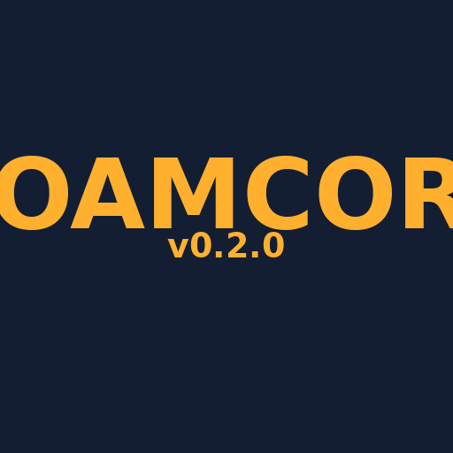

# RoamCore

RoamCore is the open-source Home Assistant companion stack for **self-contained
mobile living**: vans, RVs, overlanders, and houseboats. It packages a curated
set of contracts, dashboards, and integrations that turn a stock Home Assistant
install into a road-ready control plane — power, level, location, trip stats,
maps, weather, time, and the OpenClaw JSON API — without requiring any
proprietary cloud.



This `info.md` is the HACS-published integration metadata. It is shown to users
when they discover RoamCore in the HACS UI before installing it.

## What you get

- A single **RoamCore** integration that auto-provisions the rest of the
  stack into your Home Assistant `/config` directory on first run
  (packages, Lovelace YAML, `/www/roamcore/*`, tools, custom_components).
- A **Map** page powered by MapLibre with online OSM/CARTO tiles and an
  optional PMTiles offline overlay.
- **Contract sensors** that give every downstream dashboard a stable
  `rc_*` namespace regardless of which physical devices you own:
  - `sensor.rc_power_*` (Victron / solar / alternator)
  - `sensor.rc_level_*` (pitch / roll)
  - `sensor.rc_location_*` (Traccar device_tracker → contract)
  - `sensor.rc_trip_*` (distance, drive time, segments, stops)
  - `sensor.rc_weather_*`, `sensor.rc_time_*`
- A JSON API at `/api/roamcore/openclaw/summary` for external
  observability (OpenClaw, scripts, Grafana, etc.).

## Installation prerequisites

- **Home Assistant** 2025.1 or newer (uses HA's built-in integration
  hosting + service definitions).
- **HACS** 2.0 or newer (https://hacs.xyz/). RoamCore is published as a
  HACS custom repository while we wait for default-store listing.
- Write access to your Home Assistant `/config` directory (the
  `auto_provision_assets` option copies packages, dashboards, and
  `/www/roamcore/*` assets there on first integration start).
- (Optional) **Traccar** add-on or external Traccar instance if you
  want live GPS + trip stats. Without it, RoamCore ships tasteful
  mocks so dashboards stay populated.
- (Optional) **Victron GX** on the LAN for live power metrics.
  Without it, the power page renders as "capability-driven" — tiles
  for missing sensors are hidden, not broken.

## Installation

1. Add `https://github.com/roamcore/RoamCore` as a **Custom Repository**
   in HACS → Integrations (⋮ → Custom repositories → Category: **Integration**).
2. Install **RoamCore** from HACS → Integrations.
3. Restart Home Assistant.
4. Settings → Devices & services → Add integration → search **RoamCore**.
5. On the config flow, accept the defaults. `auto_provision_assets`
   is on by default; the integration will copy packages, dashboards,
   `/www/roamcore/*`, and tools into `/config` on first run, then post
   a persistent notification asking you to restart HA.
6. Restart Home Assistant one more time so packages/components load.

For the manual fallback (or to pin a specific git ref), call the
service from Developer Tools → Services:

```yaml
service: roamcore.provision_assets
data:
  repo: https://github.com/roamcore/RoamCore
  ref: main
```

## Usage

After install + restart, your RoamCore dashboard is reachable at
`/roamcore/dashboard` (or via the **RoamCore** sidebar entry). The
auto-provisioner creates:

- `homeassistant/packages/roamcore_*.yaml` — contract templates
- `homeassistant/lovelace/roamcore/...` — Lovelace YAML for the Map page
- `homeassistant/www/roamcore/...` — JS / CSS bundles (MapLibre, theme)
- `homeassistant/tools/...` — Trip Wrapped exporter, support tools

All of those are backed up under `/config/.roamcore/backups/<timestamp>/`
on every provision, so re-provisioning is non-destructive.

For the OpenClaw JSON API:

```text
GET http://<ha>:8123/api/roamcore/openclaw/summary
Authorization: Bearer <HA long-lived access token>
```

Full reference: `docs/reference/openclaw-json-api.md`.

## Support

- Documentation: https://github.com/roamcore/RoamCore
- Issues / bug reports: https://github.com/roamcore/RoamCore/issues
- Discussions: https://github.com/roamcore/RoamCore/discussions
- Release notes: https://github.com/roamcore/RoamCore/releases

## License

MIT — see `LICENSE` at the repo root.
